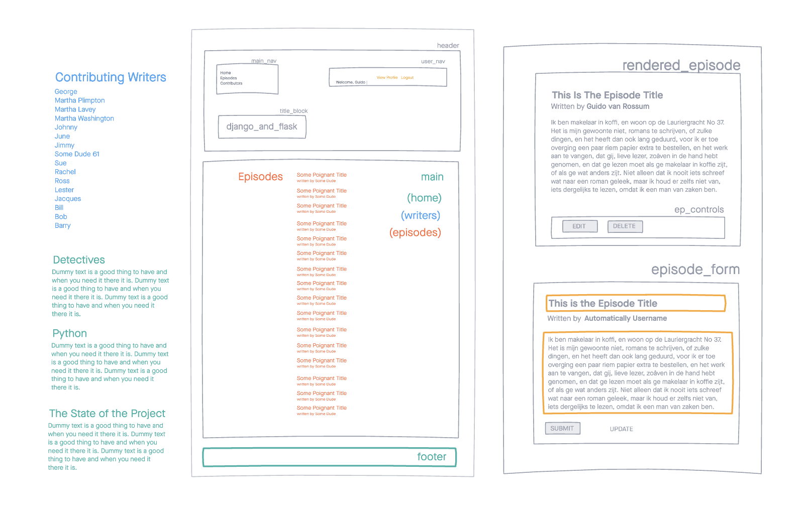
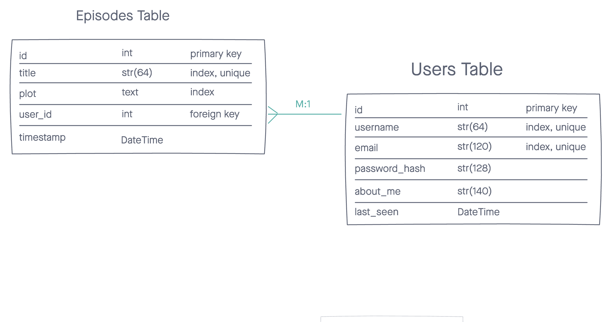

## Django and Flask
---
### Crowdsourced Detective Series
---
_Django and Flask_ is an imaginary television detective show, set in the Dutch capital of Amsterdam. Its two lead characters take their names from the two major web frameworks written in the Python programming language, originally created by Guido van Rossum.

Taking on the characteristics that uniquely indentify their related web-frameworks, Detectives Django and Flask make a unique pairing whose storylines offer special enjoyment to web developers and others who may delight in layered meta-commentary and self-referential symbolism.

Django and Flask will be crowdsourced and created through community. So sign up and start contributing episodes. Together, let's discover what this show can become.

---
### Web Development Project
---
_Django and Flask_ is a project conceived and developed by Chicago-based software engineer Blake Montgomery.

It utilizes:
Python
Flask
HTML
CSS
Bootstrap
JavaScript
React 

There are two versions of the app. The first is a simple backend Flask app serving up Jinja2 templates to the user. It incorporates WTForms to validate and secure communications with the server. It has a simple design made with Bootstrap and some hand-coded CSS. The second version uses a the FLASK backend to serve json data to a REACT frontend. The app does not use any frontend routing but juggles the various content views by shuffling, hiding, and revealing layers. The CSS for this second app is all hand-coded.

BACKEND ONLY: https://server-only-dj-and-flask.herokuapp.com/

FLASK-API with REACT FRONTEND: https://flask-detective-react-frontend.herokuapp.com/

---
### PROCESS
---

LINK TO TRELLO PLANNING BOARD:
https://trello.com/b/DUkch4pm/djangoflask

---
### CHALLENGES
---
Still in development on the React/Flask-Api app: full user CRUD to accompany the operations on the Episodes model.

Also, still trying to replicate all of the built in security features that were possible in the server-side app. Especially working on further understanding the mechanism behind CSRF protections.

---
### POSSIBILITIES
---
The idea of crowd-sourcing a television show seems more and more interesting (at least on a technical level) the longer I play with it. There is ample room to add features: a way to develop characters and not just storylines. A way to put individual episodes into playlists and propose seasons, story-arcs, etc. Maybe there are different versions of episode creation to explore: perhaps pictoral or more structured text. 

The one clear demand, as the app gains momentum, would be to find ways to segment the information. Following specific users offers a way to begin to filter results. Liking episodes is also a way for the community to set directions and allow a vision to emerge. 

There are technical hurdles but also imaginative, experience-guiding challenges to grapple with. And, the original inspiration remains to be achieved: a comparison of both Flask and Django and a deeper understanding of opinionated vs non-opinionated frameworks.